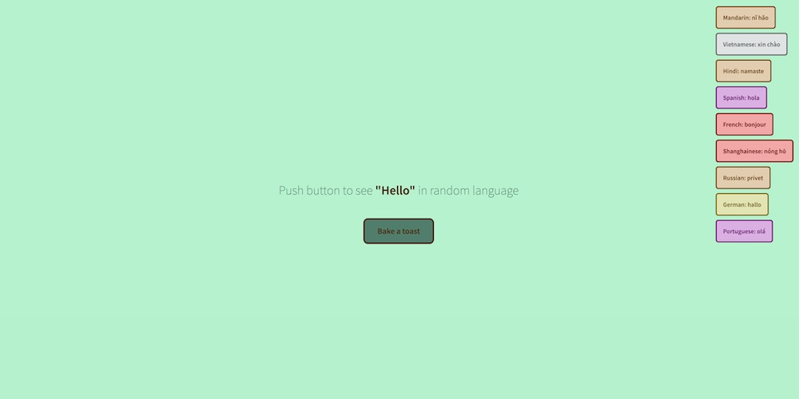

# Random Hello

This is basic JavaScript educational project.
  
It's just a fun/informative website. Clicking button delivers "hello" word in different languages.
`Toasts are perfect to be comment or popping message to confirm sending review form/placing order etc.`
  

   

### Future developement ideas:

- introduce displaying toasts randomly in space of whole screen except the "toaster" button
    

### Credits:

- inspiration based on Brad Traversy's [tutorial](https://github.com/bradtraversy/50projects50days/tree/master/toast-notification)

 
brulionman 05/21
